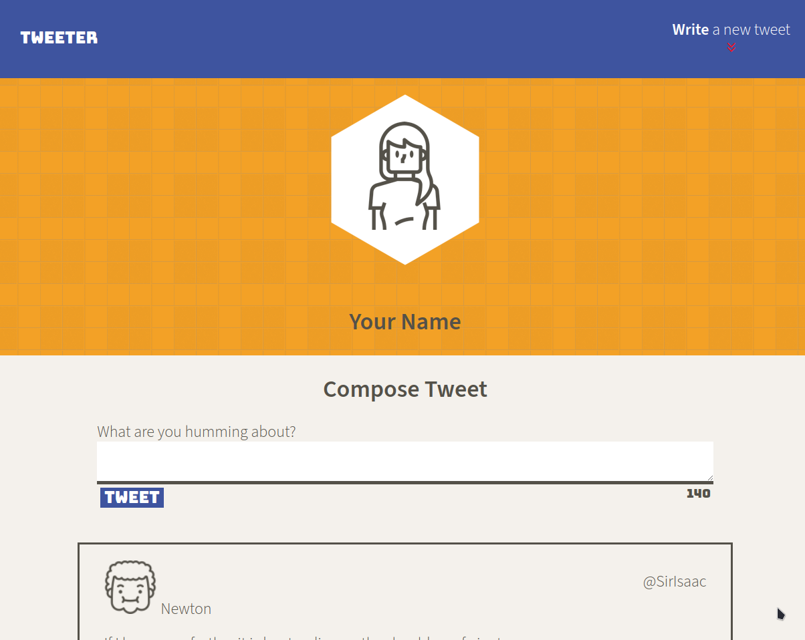
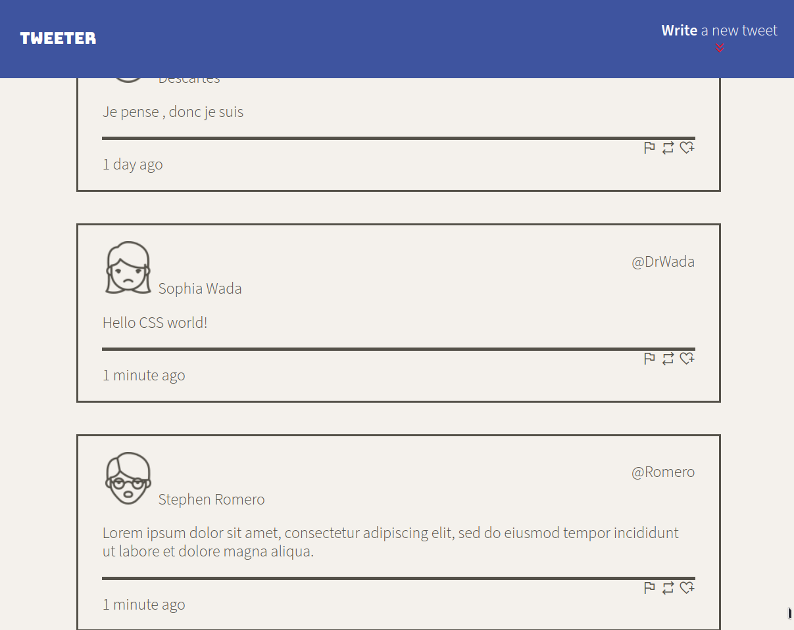
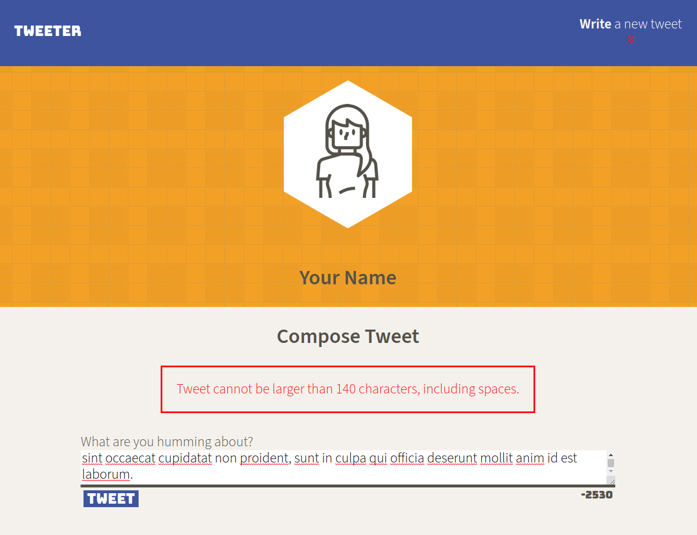

# Tweeter Project

Tweeter is a simple, single-page Twitter clone.

This project is for learning purposes.

## Getting Started

1. Install dependencies using the `npm install` command.
2. Start the web server using the `npm run local` command. The app will be served at <http://localhost:8080/>.
3. Go to <http://localhost:8080/> in your browser.

## Dependencies 

- Express
- Node v16.13.2+

note:

- cors module has been added as a workaround for local development

Client side libraries
- [Jquery](https://jquery.com/)
- [timeago](https://github.com/hustcc/timeago.js)

